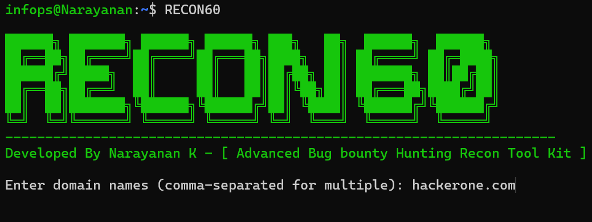

<h1 align="center">
  <br>
  <a href="#"></a>
  <br>
  RECON60 - Advanced Bug Bounty Hunting Tool
  <br>
</h1>

<h4 align="center">Advanced ( 🔥 ) Advanced Bug Bounty Hunting Recon Tool Kit V2.0</h4>  

The Advanced Bug Bounty Hunting Recon Tool Kit is a comprehensive automation suite designed for bug bounty hunters. It simplifies the process of reconnaissance by combining subdomain enumeration, URL collection, and vulnerability discovery into a single streamlined workflow. The tool identifies live domains, collects and analyzes paths, and filters files of interest efficiently.

## Features

- **Tool Installation Check**: Ensures required tools are installed and installs them automatically if missing.
- **Subdomain Enumeration**: Uses tools like subfinder and assetfinder to gather subdomains.
- **Active Subdomain Checking**: Verifies live domains using httpx.
- **URL Collection**: Leverages `waybackurls`, `gau`, `gospider`, `hakrawler`, and `katana` for comprehensive URL enumeration.
- **File Filtering**: Identifies specific file types like `.php`, `.json`, `.env`, and more from collected URLs.
- **Open Redirect Detection**: Extracts parameters that may indicate open redirect vulnerabilities.
- **Output Management**: Stores results in structured directories for easy access.


## Installation

RECON60 requires Go to be installed on your system to run and install the necessary tools. Follow these steps to get started:

1. **Install Go:**:
   If Go is not installed, download and install it from [https://go.dev/].

2. **Install RECON360:**:
   ```bash
   go install github.com/Narayanan-info/RECON60@main
   ```

3. **Install the necessary tools:**:
    The tool will automatically check and install missing tools such as `subfinder`, `assetfinder`, `httpx`, `waybackurls`, `gau`, `gospider` etc.

4. **Output Structure:**:

   * Subdomains:

      * subdomains.txt: All discovered subdomains.
      * Genesis-Sub.txt: Unique subdomains.

   * Live Subdomains:

      * Genesis-live.txt: Verified live subdomains.

   * Collected URLs:

      * wayback/wayback-url.txt: URLs from waybackurls.
      * gau/gau-urls.txt: URLs from gau.
      * gospider/gospider-urls.txt: URLs from gospider.
      * hakrawler/hakrawler-urls.txt: URLs from hakrawler.
      * katana/katana-urls.txt: URLs from katana.
      * paths.txt: Merged URLs.

   * Live URLs:

      * Final-Live/URL-LIVE.txt: Checked live URLs.
      * Final-Live/URL-LIVE-UNIQUE.txt: Unique live URLs.

   * Filtered Files:

      * Separate directories for `.php`, `.json`, `.env`, and other file types.

   * Open Redirects:

      * Open-Redirect/redirect_params.txt: Parameters potentially vulnerable to open redirects.